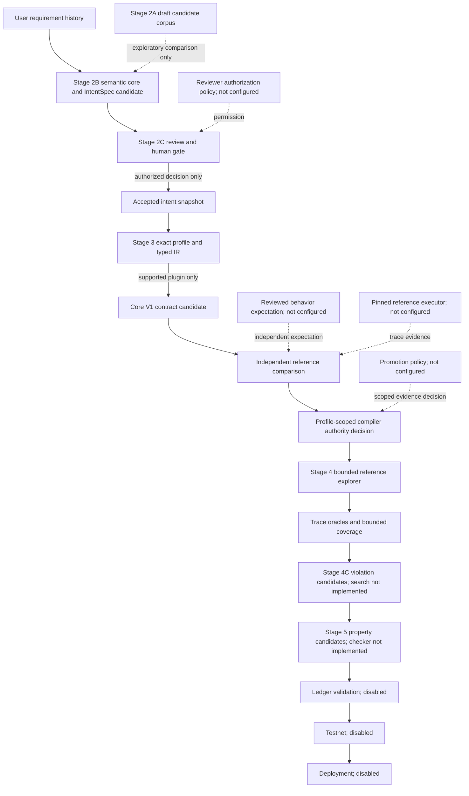

# Research assurance architecture v1

Status: `ARCHITECTURE_SPECIFIED_AND_SCAFFOLDED`. This is not model, compiler,
reference, oracle, ledger, or production validation. Legacy Node 1/2/3 remains
the default production route.

## Objective and evidence scope

This document describes the research system's interfaces, dataflow and trust
boundaries for a system-design chapter. It does not report semantic accuracy or
an end-to-end result. The component-by-component evidence and authority limits
are recorded in [implementation-status-v1.md](implementation-status-v1.md).
The current implementation can be reported as an architecture with offline
contract smoke, not as a validated contract-synthesis system.

## Dataflow and trust boundaries

```text
requirement-history
  -> Stage 2B ShadowSemanticCore + deterministic IntentSpec projection
     [MODEL_CANDIDATE]
  -> Stage 2C review, clarification, explicit human decision
     [USER_ACCEPTED_INTENT; immutable snapshot, not correctness proof]
  -> Stage 3 exact profile -> typed CompilationIR -> deterministic plugin
     -> structural Core V1 AST gate [COMPILER_CANDIDATE]
  -> independent BehaviorExpectation + pinned reference execution
  -> profile/version/evidence-scoped promotion policy [default CANDIDATE_ONLY]
  -> Stage 4 bounded reference exploration -> trace oracles -> coverage
     -> adversarial finding candidates
  -> Stage 5 property candidates -> external checker/review -> registry
  -> ledger -> testnet -> deployment [all disabled]
```

The following diagram uses solid edges for **data flow** and dashed edges for
**authority/evidence inputs**. Conditional data edges do not imply that the
default composition has cleared their gates.



There is no automatic repair edge from an oracle or property candidate back to
accepted intent or the compiler. Reference execution supplies behavioral
evidence for explicit traces in its pinned model; it is not ledger authority.

`research.architecture` contains only shared models, ports, artifact identity,
provenance, status and orchestration. It never imports concrete stages at module
import time. `research.architecture.bootstrap` is the composition root; stage
imports and the live model transport are lazy. Stage modules depend on shared
primitives, not on the concrete orchestrator. The production CLI is the opt-in
route: `--research-mode legacy|shadow|candidate|authorized`. `legacy` remains
the default and retains its output. `--research-live` is required before the
sidecar/candidate route may call the model. `authorized` fails closed until a
profile-scoped promotion policy and evidence are reviewed and configured.
The CLI research snapshot includes readable candidate/review/contract artifacts,
but no CLI reviewer-policy provider or profile compiler is configured in v1;
it cannot issue a production-authorized contract.

## Artifact and status ADRs

- `canonical_json_v1` is UTF-8 JSON with sorted keys and compact separators.
  Payloads allow string keys, arrays, strings, integers, booleans and null; no
  float, NaN, implicit Unicode normalization or newline conversion.
- `content_hash = SHA256(canonical_json_v1(payload))`.
  `artifact_id = artifact_type:schema_version:cj1:content_hash`. Type and schema
  separate domains. Envelope, timestamps, producer, run metadata and lineage
  are not hashed. Semantic source/version facts belong inside payload.
- Provenance edges are independent records, so identical content can occur in
  separate runs without losing lineage. Corrections create new artifacts; no
  in-place mutation or self-referential envelope hash.
- All stages use `ImplementationStatus` for lifecycle and `StageRunStatus` for
  execution. Domain statuses such as `CompileStatus` and `PropertyStatus` do
  not substitute for either. Assurance verdict, method, coverage, authority,
  limitations and evidence are separate axes. A `SUCCEEDED` stage means only
  that its port returned a structured result.
- Expected provider/model/parser failures are infrastructure errors; unresolved
  business intent is a review issue. Unsupported profile, unavailable reference,
  timeout and inconclusive comparison never become user business questions.
- `AUTHORIZED_FOR_PROFILE` is valid only for its profile/version, compiler,
  intent schema, Core V1 format, pinned reference and evidence-policy scope.
  It authorizes deterministic mapping only, not Stage 4/5 behavior or ledger
  validity. No promotion policy is registered by default. A finite differential
  trace alone is insufficient for promotion.
- Stage 2C also needs an injected reviewer-authorization policy. A self-reported
  reviewer ID and consent flag alone cannot grant `USER_ACCEPTED_INTENT`.

The lifecycle (`ImplementationStatus`), a particular run's state
(`StageRunStatus`), semantic result (`CompileStatus`, `PropertyStatus`),
assurance verdict and authority are independent. In particular, a stage can
return `SUCCEEDED` because it issued a structured `CANDIDATE_ONLY` decision;
this is not a successful promotion. Content identity does not identify a run:
the same requirement artifact may be reused in separate runs with distinct
run IDs and provenance records.

## Interfaces and current implementation

| Component | Boundary | Lifecycle | Default outcome |
| --- | --- | --- | --- |
| Shared artifacts, status, provenance, orchestrator | Pure Python, injected `StagePort` | IMPLEMENTED_UNVALIDATED | Typed run/checkpoint |
| Stage 2A frozen corpus adapter | Read-only, verify frozen candidate corpus | IMPLEMENTED_UNVALIDATED | No user authority |
| Stage 2B adapter | Existing shadow extractor/projector/validators | IMPLEMENTED_UNVALIDATED | NOT_EVALUATED without model |
| Stage 2C | Deterministic review and explicit consent | IMPLEMENTED_UNVALIDATED | WAITING_USER |
| Stage 3 profile/IR/compiler | Exact profile and injected deterministic plugin | IMPLEMENTED_UNVALIDATED | UNSUPPORTED without profile |
| Stage 3 reference comparison | Independent reviewed expectation and pinned driver | IMPLEMENTED_UNVALIDATED | INCONCLUSIVE without executor/expectation |
| Stage 3 authority | Explicit policy + decision + evidence | IMPLEMENTED_UNVALIDATED | CANDIDATE_ONLY |
| Stage 4 explorer/oracles/coverage | Explicit transaction domain and reference executor | IMPLEMENTED_UNVALIDATED | NOT_EVALUATED without domain |
| Stage 4 adversarial search | Finding selection only; search strategy unimplemented | SCAFFOLDED | No automatic repair |
| Stage 5 property checker | Candidate registry; no checker integration | SCAFFOLDED | INCONCLUSIVE |
| Node 3 SMT adapter | Existing SMT statuses; opt-in | IMPLEMENTED_UNVALIDATED | Not run by default |
| Ledger/testnet/deployment | Disabled ports, no network/signing | SCAFFOLDED | NOT_EVALUATED |

The reference adapter uses the pinned `tools/marlowe_smt/run_reference.py`
wrapper. Its `Success`/`TransactionError` are trace results, while
`Unavailable`/`Timeout`/`InvalidInput`/`Unsupported` cannot establish a pass.
The expectation source must be an accepted intent or independently reviewed
profile/scenario; it is never derived from the compiled AST. Comparison also
requires a separate content-addressed `behavior-expectation` artifact and an
injected reviewer policy. The expectation cannot carry an AST; an option string
naming a source is not enough. Explorer successors use `final_state` and
`final_contract` only on `Success`; failed
transactions do not commit state. It does not deduplicate path-sensitive
histories. Coverage remains `BOUNDED` even if the supplied domain enumeration
ends; completeness requires a separately checked finite-domain argument.
The explicit domain template supports Deposit, Choice, Notify and timeout
transactions with POSIX-millisecond intervals. Before `T` means `to < T`,
after `T` means `from >= T`, and `from < T <= to` is straddling, not before or
after. The template never infers missing actors, values or deadlines.

## Stage-specific boundaries

- Stage 2A's frozen corpus remains a set of draft candidate annotations. Its
  public validation set is not blind or human-reviewed ground truth. Stage 2B
  extraction is still under evaluation; deterministic projection establishes
  a reproducible mapping from a *given* semantic core, not the accuracy of that
  core against the user's intent.
- Stage 2C deterministically surfaces candidate issues and can pause for a
  decision. The injected `ReviewerPolicy` is an authorization boundary, not a
  reviewer identity-verification implementation. An accepted snapshot is
  immutable/versioned user-reviewed intent only when that external policy and
  explicit consent are supplied; default composition supplies neither.
- Stage 3 rejects unsupported/ambiguous profiles and requires an injected
  deterministic compiler plugin. It checks Core V1 structure and the
  **presence** of `source_kind`, `source_id` and nonempty `ast_path` coverage
  over expected semantic objects. It does not validate the semantic meaning or
  existence of every claimed AST path. Mapping faithfulness needs future
  profile-specific reference/differential evidence. No LLM AST fallback is
  present in the research compiler path.
- Semantic comparison needs a separately reviewed behavior-expectation
  artifact, an expectation policy and a reference executor. The compiled AST
  is not the source of expected behavior. A pinned `Success` or expected
  `TransactionError` concerns the supplied state, transaction sequence and
  Marlowe model only; `Unavailable`, `Timeout` and unknown statuses do not
  establish a pass. The promotion policy is absent by default, so no profile
  gains compiler authority from a single comparison.
- Stage 4 exploration uses explicit transaction templates and bounded
  reference transitions. The current oracle checks warnings on observed
  traces; a trace-local `SATISFIED` verdict is not a universal property.
  Coverage remains `BOUNDED`, even when template enumeration ends. Stage 4C
  only selects violation candidates (`search_performed=False`); it does not
  run an adversarial strategy or automatically repair a contract.
- Stage 5 records property candidates and a versioned registry seam. Its
  `PropertyChecker` protocol is not connected to formalization or a proof
  checker in the default composition. Ledger, testnet and deployment are
  disabled ports returning `NOT_EVALUATED` when reached.

## Failure propagation

An invalid Stage 2B candidate blocks Stage 2C and leaves compilation
`NOT_EVALUATED`. Without an authorized human decision there is no accepted
intent; without an exact profile and plugin there is no contract candidate.
Without independently reviewed expectations or a reference executor,
comparison is `INCONCLUSIVE`; without reference evidence, the authority stage
can record only `CANDIDATE_ONLY`. Missing exploration configuration means no
concrete oracle/coverage result. An observed oracle satisfaction does not
promote a global property. Without checker/review and external adapters there
are no validated property, ledger, testnet or deployment claims. See the
[failure table](implementation-status-v1.md#failure-and-uncertainty-propagation)
for the corresponding stage outcomes.

## Checkpoint and side-effect policy

`ResearchOrchestrator` persists stage results, artifact IDs and provenance in
memory. `stop_after` and `resume` support a human wait without a busy process;
resuming requires the same source artifact and store. This is not yet a durable
cross-process event store. Missing ports and upstream blockers produce typed
`NOT_EVALUATED`, not synthetic success. The authority stage can still emit
`CANDIDATE_ONLY` after an inconclusive/unavailable reference comparison.
The CLI candidate route does not silently fall back to LLM-generated AST.
No profile plugin, live model, SMT, reference executor, domain, ledger adapter,
wallet, testnet connection or deployment credentials are configured by default.

The offline smoke file tests selected contract boundaries, including a
synthetic all-port DAG. Its synthetic `SUCCEEDED` stages have no assurance
claims and do not establish concrete end-to-end execution. This documentation
task ran `python -m pytest research/architecture/test_contract_smoke.py -q`
locally (`17 passed in 0.09s`); no independent CI/workflow result is used as
evidence here. See the
[smoke evidence inventory](implementation-status-v1.md#what-the-offline-smoke-file-actually-exercises)
before quoting test results in a report.

## Claims permitted in the current research report

The report may say that the project **defines** versioned content-addressed
artifacts and separate provenance; separates implementation lifecycle, run
status, verdict and authority; introduces an explicit human acceptance
boundary; gates deterministic compilation by profile with no LLM AST fallback
in the research path; treats pinned reference semantics as behavioral evidence
within its explicit model/trace; and represents bounded exploration, trace
oracles and fail-closed external seams. Source-present offline smoke exercises
specific architecture contracts and selected failure boundaries.

The current evidence does **not** support claims that semantic extraction is
accurate; a real reviewer's identity is authenticated; compiler mappings are
semantically faithful or the compiler is verified; exploration is exhaustive;
properties are formally proven; Cardano ledger validity is established;
testnet/deployment succeeds; or the system is production-ready. Interface
wiring is represented and smoke-tested, but concrete end-to-end execution has
not been demonstrated.

## Validation backlog

1. Durable checkpoint store, replay/idempotency and side-effect budget policy.
2. Stage 2C human UX, corrected history provenance and acceptance tests.
3. Golden compiler profiles with complete mapping and differential evidence.
4. Independent trace expectations, pinned reference and SMT campaigns.
5. Explorer domain soundness, oracle applicability, path coverage and interval cases.
6. Adversarial search, formal property checker and versioned proof evidence.
7. Stage 2B semantic evaluation on reviewed data, not draft candidate labels.
8. Ledger/testnet integration and operator-reviewed deployment gates.

Do not describe this architecture as verified, proven or production-ready.
